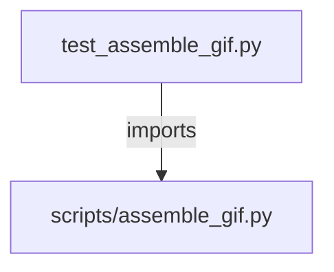

# CONNECTIONS tests/scripts/test_assemble_gif.py

## Relationship Summary

- Imports 1 internal file(s).
- Imported by 0 internal file(s).
- Matched test files: 0.

## Internal Imports

- `scripts/assemble_gif.py`

## Candidate Sources Exercised By This Test File

- `scripts/assemble_gif.py`

## Mermaid

