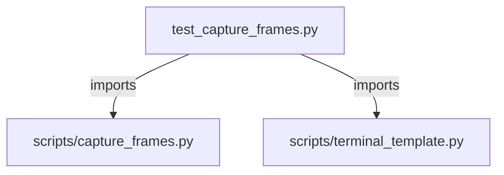

# CONNECTIONS tests/scripts/test_capture_frames.py

## Relationship Summary

- Imports 2 internal file(s).
- Imported by 0 internal file(s).
- Matched test files: 0.

## Internal Imports

- `scripts/capture_frames.py`
- `scripts/terminal_template.py`

## Candidate Sources Exercised By This Test File

- `scripts/capture_frames.py`

## Mermaid

