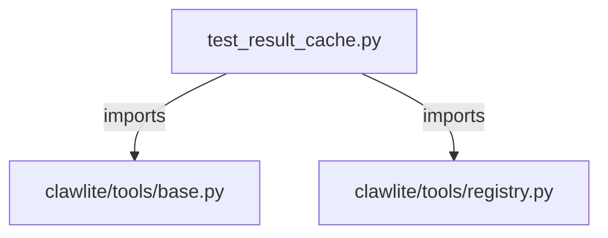

# CONNECTIONS tests/tools/test_result_cache.py

## Relationship Summary

- Imports 2 internal file(s).
- Imported by 0 internal file(s).
- Matched test files: 0.

## Internal Imports

- `clawlite/tools/base.py`
- `clawlite/tools/registry.py`

## Mermaid

