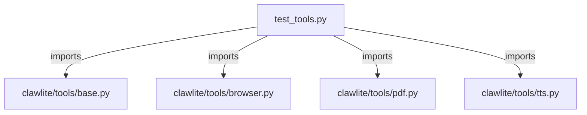

# CONNECTIONS tests/tools/test_tools.py

## Relationship Summary

- Imports 4 internal file(s).
- Imported by 0 internal file(s).
- Matched test files: 0.

## Internal Imports

- `clawlite/tools/base.py`
- `clawlite/tools/browser.py`
- `clawlite/tools/pdf.py`
- `clawlite/tools/tts.py`

## Candidate Sources Exercised By This Test File

- `clawlite/tools/__init__.py`
- `clawlite/tools/agents.py`
- `clawlite/tools/apply_patch.py`
- `clawlite/tools/base.py`
- `clawlite/tools/browser.py`
- `clawlite/tools/cron.py`
- `clawlite/tools/discord_admin.py`
- `clawlite/tools/exec.py`
- `clawlite/tools/files.py`
- `clawlite/tools/jobs.py`
- `clawlite/tools/mcp.py`
- `clawlite/tools/memory.py`
- `clawlite/tools/message.py`
- `clawlite/tools/pdf.py`
- `clawlite/tools/process.py`
- `clawlite/tools/registry.py`
- `clawlite/tools/sessions.py`
- `clawlite/tools/skill.py`
- `clawlite/tools/spawn.py`
- `clawlite/tools/tts.py`

## Mermaid

