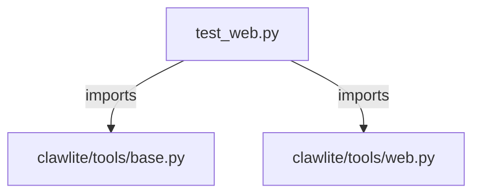

# CONNECTIONS tests/tools/test_web.py

## Relationship Summary

- Imports 2 internal file(s).
- Imported by 0 internal file(s).
- Matched test files: 0.

## Internal Imports

- `clawlite/tools/base.py`
- `clawlite/tools/web.py`

## Candidate Sources Exercised By This Test File

- `clawlite/gateway/webhooks.py`
- `clawlite/gateway/websocket_handlers.py`
- `clawlite/tools/web.py`

## Mermaid

