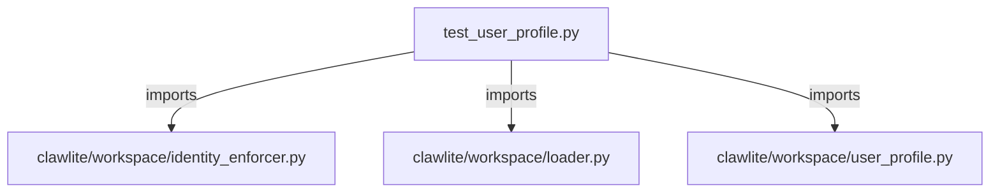

# CONNECTIONS tests/workspace/test_user_profile.py

## Relationship Summary

- Imports 3 internal file(s).
- Imported by 0 internal file(s).
- Matched test files: 0.

## Internal Imports

- `clawlite/workspace/identity_enforcer.py`
- `clawlite/workspace/loader.py`
- `clawlite/workspace/user_profile.py`

## Candidate Sources Exercised By This Test File

- `clawlite/workspace/user_profile.py`

## Mermaid

